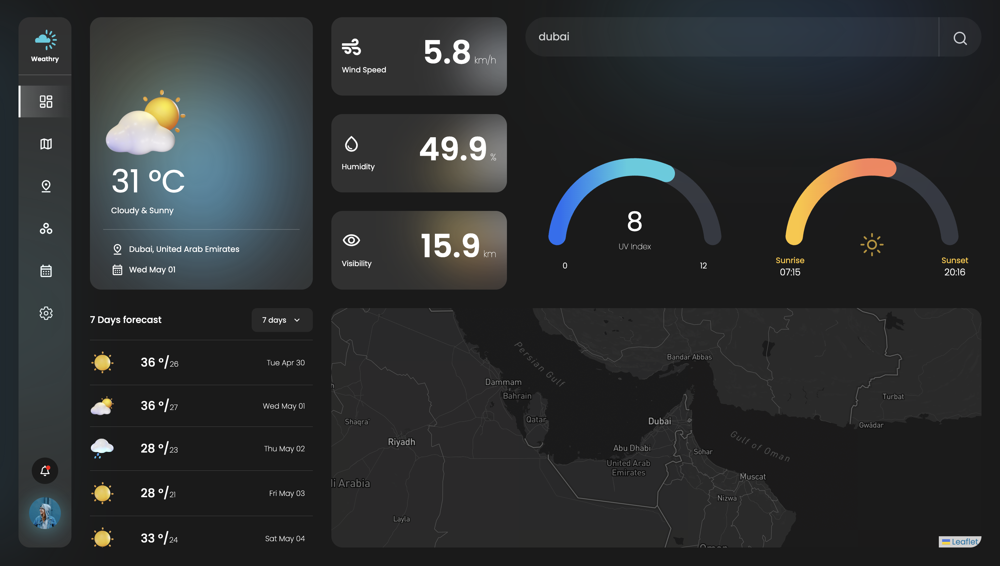

## Realtime Weather Dashboard
___
A dashboard for realtime weather data visualisation. Displays realtime weather data like temperature, UV Index, Wind Speed etc. and Forecast data based on users current location or search queries.



### Getting Started
___

Open a terminal window and navigate to the directory where you want to clone this repo

```
$ git clone https://github.com/vansh2308/weather-dashboard.git
$ cd ./weather-dashboard 
```

Install all the dependencies
```
$ npm install
$ npm run dev
```

Just type in http://localhost:5173/ in your browser to open the dashboard 

### Built With
___
- React JS
- Tailwind CSS
- Redux
- Mapbox 
- React-Leaflet

